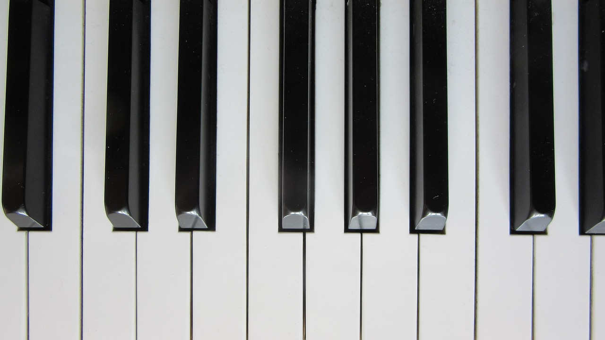

# 🎹 JavaScript Piano

Ein einfaches virtuelles Piano, das mit der Tastatur gespielt werden kann. Beim Drücken bestimmter Tasten wird ein Ton abgespielt und die jeweilige Taste visuell hervorgehoben.

---

## 🧠 Projektidee

Ziel war es, ein interaktives Piano mit **HTML**, **CSS** und **JavaScript** (ohne Frameworks) zu entwickeln. Das Piano reagiert auf Tastendrücke mit passenden Audioausgaben und optischen Effekten.

---

## ⌨️ Verwendete Tasten

Folgende Tasten lösen Pianotöne aus (deutsches Tastaturlayout):
A, W, S, E, D, F, T, G, Z, H, U, J, K, O, L, P, Ö, Backspace


🔹 **Hinweis:** Die Taste **Backspace** wird nicht angezeigt (display: none), ist aber funktional aktiv.  
🔹 Die `data-key`-Werte wurden mithilfe von [keycode.info](https://keycode.info) bestimmt.

---

## 🖼️ Vorschau



---

## 💡 Zusatzfeatures

- Hinweis-Animation beim Hover (Hints)
- Responsives Layout
- Klavierspielen mit der Tastatur 🎶

---

## 🛠️ Verwendete Technologien

- HTML5  
- CSS3  
- Vanilla JavaScript (ES6)

---

## 🚀 Verwendung

```bash
# Repository klonen
git clone https://github.com/DeinBenutzername/js-piano.git

# Öffne die Datei im Browser
index.html


## P.S.: Dieses Projekt habe ich für ein 3-jähriges Kind erstellt, damit es seinem Papa zum Geburtstag selbst ein kleines Lied auf dem virtuellen Klavier vorspielen kann. 🎁🎶🎂❤️
